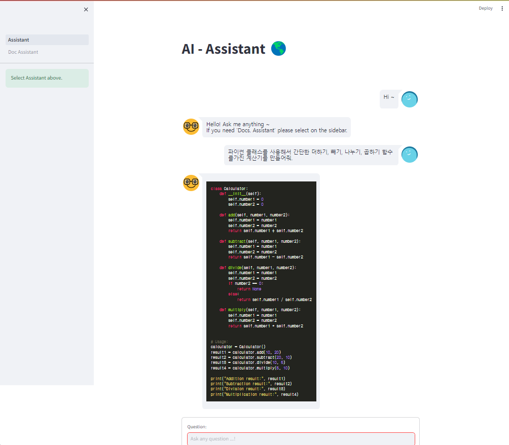
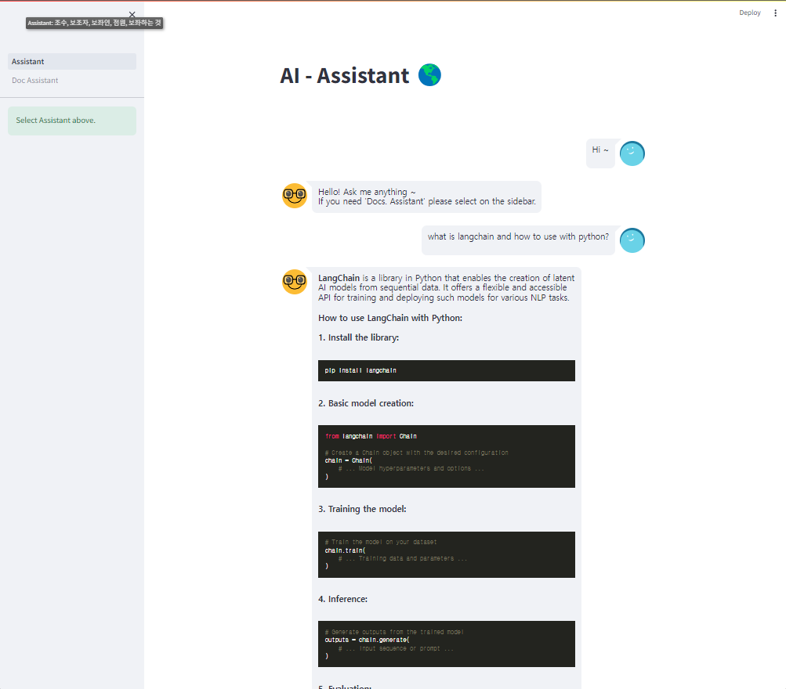

# AI Assistant
**Ollama** 에서 제공하는 LLM과 **Streamlit(Frontend)** 을 사용하여 만든 간단한 UI를 가진 채팅 형식의 **AI Assistant 프로젝트** 입니다.

두가지 다른 Assistant를 사용할 수 있으며, 첫번째 페이지에는 일반적인 LLM 기능을 수행하는 Assistant, 두번째 페이지에는 문서를 기반으로 LLM Q/A 기능을 수행하는 Doc. Assistant가 구축되어 있습니다.

OpenAI로 부터가 아닌 설치된 Local LLM을 불러와 사용/답변하기 때문에, 정보 및 보안 유출 걱정없이 사용하기에 적합합니다. 추후, 더 강력한 오픈소스 LLM 모델로 업데이트하여 보다 좋은 성능의 Assistant로 활용될 수 있습니다. (**유지보수 편리**)

 

## Installation
사전에 **Ollama**를 설치하여 Google이 제공하는 LLM모델인 "**Gemma**"모델을 설치하여야 합니다.
Ollama 및 LLM모델 설치는 아래 URL를 참고하여 설치하시기 바랍니다.
- URL: https://ollama.com/download

 

**1. Requirements:**
1. Python Version 3.10.0 설치
2. requirements.txt 필요/담긴 라이브러리 설치
3. 메인 디렉토리로 이동 및 CMD 실행
4. CMD:
    - streamlit run Assistant.py

 

**2. GPU Used:**
- NVIDIA GeForce RTX 3080 Ti Laptop GPU (16GB)
  - Minimum 8~10GB GPU Memory recomanded
  - Minimum 32GB RAM recomanded for Doc. Assistant

 

## Usage

#### Examples:

 

